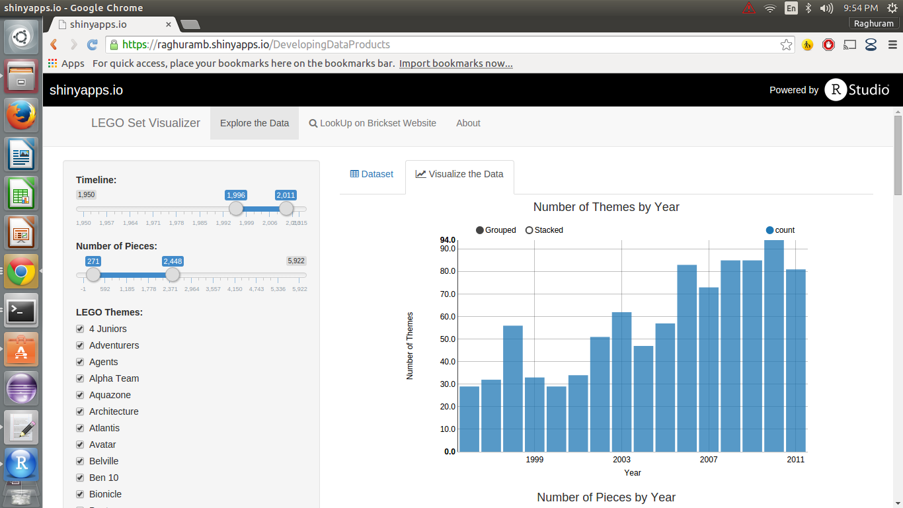

## Details and Credits 
This Shiny App is for searching and visulizating LEGO Sets information from year 1950 to 2015. The total number of set records is 10036 and that of theme records is 100.  
The dataset is from [Rebrickable.com](http://rebrickable.com/) that contains the basic information of each set (set id, year, number of pieces, theme, set name).  

Data Source: http://rebrickable.com/downloads  
Date updated: 2015-09-27  

--- .class #id 

## The code for ui.R


```r
# The user-interface definition of the Shiny web app.
library(shiny)
library(BH)
library(rCharts)
#Devtools
require(markdown)
require(data.table)
library(dplyr)
#Devtools
library(DT)

shinyUI(
    navbarPage("LEGO Set Visualizer", 
               # multi-page user-interface that includes a navigation bar.
               tabPanel("Explore the Data",
                        sidebarPanel(
                            sliderInput("timeline", 
                                        "Timeline:", 
                                        min = 1950,
                                        max = 2015,
                                        value = c(1996, 2015)),
                            sliderInput("pieces", 
                                        "Number of Pieces:",
                                        min = -1,
                                        max = 5922,
                                        value = c(271, 2448) 
                            ),
                            #format = "####"),
                            uiOutput("themesControl"), # the id
                            actionButton(inputId = "clearAll", 
                                         label = "Clear selection", 
                                         icon = icon("square-o")),
                            actionButton(inputId = "selectAll", 
                                         label = "Select all", 
                                         icon = icon("check-square-o"))
                            
                        ),
                        mainPanel(
                            tabsetPanel(
                                # Data 
                                tabPanel(p(icon("table"), "Dataset"),
                                         dataTableOutput(outputId="dTable")
                                ), # end of "Dataset" tab panel
                                tabPanel(p(icon("line-chart"), "Visualize the Data"), 
                                         h4('Number of Themes by Year', align = "center"),
                                         showOutput("themesByYear", "nvd3"),
                                         h4('Number of Pieces by Year', align = "center"),
                                         h5('Please hover over each point to see the Set Name and ID.', 
                                            align ="center"),
                                         showOutput("piecesByYear", "nvd3"),
                                         h4('Number of Average Pieces by Year', align = "center"),
                                         showOutput("piecesByYearAvg", "nvd3"),
                                         h4('Number of Average Pieces by Theme', align = "center"),
                                         showOutput("piecesByThemeAvg", "nvd3")
                                ) # end of "Visualize the Data" tab panel
                                
                            )
                            
                        )     
               ), # end of "Explore Dataset" tab panel
               
               tabPanel(p(icon("search"), "LookUp on Brickset Website"),
                        mainPanel(
                            h4("The page popped-up is the LEGO set database on Brickset.com."),
                            h4("Step 1. Please type the Set ID below and press the 'Go!' button:"),
                            textInput(inputId="setid", label = "Input Set ID"),
                            #p('Output Set ID:'),
                            #textOutput('setid'),
                            actionButton("goButtonAdd", "Go!"),
                            h5('Output Address:'),
                            textOutput("address"),
                            p(""),
                            h4("Step 2. Please click the button below. 
                               The link to the Set's page is being generated."),
                            p(""),
                            actionButton("goButtonDirect", "Generate Link Below!"),
                            p(""),
                            htmlOutput("inc"),
                            p("I was supposed to show you in an iframe below. However, it only
                   worked on localhost and has security issue after deployed to the cloud. Ooops...")
                            
                            )         
               ),
               
               tabPanel("About",
                        mainPanel(
                            includeMarkdown("about.md")
                        )
               ) # end of "About" tab panel
    )
    
)
```

--- .class #id 

## The code for server.R

```r
library(shiny)

# Load data processing file
source("data_processing.R")
themes <- sort(unique(data$theme))

# Shiny server
shinyServer(
    function(input, output) {
    
        output$setid <- renderText({input$setid})
        
        output$address <- renderText({
            input$goButtonAdd
            isolate(paste("http://brickset.com/sets/", 
                          input$setid, sep=""))
            
        })
        
        #     getPage<-function(url) {
        #         return(tags$iframe(src = url, 
        #                            style="width:100%;",  
        #                            frameborder="0", id="iframe", 
        #                            height = "500px"))
        #     }
        
        openPage <- function(url) {
            return(tags$a(href=url, "Click here!", target="_blank"))
        }
        
        output$inc <- renderUI({ 
            input$goButtonDirect
            isolate(openPage(paste("http://brickset.com/sets/", 
                                   input$setid, sep="")))
             
        })
        
        
        # Initialize reactive values
        values <- reactiveValues()
        values$themes <- themes
        
        # Create event type checkbox
        output$themesControl <- renderUI({
            checkboxGroupInput('themes', 'LEGO Themes:', 
                               themes, selected = values$themes)
        })
        
        # Add observer on select-all button
        observe({
            if(input$selectAll == 0) return()
            values$themes <- themes
        })
        
        # Add observer on clear-all button
        observe({
            if(input$clearAll == 0) return()
            values$themes <- c() # empty list
        })
        
        # Prepare dataset
        dataTable <- reactive({
            groupByTheme(data, input$timeline[1], 
                         input$timeline[2], input$pieces[1],
                         input$pieces[2], input$themes)
        })
        
        dataTableByYear <- reactive({
            groupByYearAgg(data, input$timeline[1], 
                           input$timeline[2], input$pieces[1],
                           input$pieces[2], input$themes)
        })
        
        dataTableByPiece <- reactive({
            groupByYearPiece(data, input$timeline[1], 
                             input$timeline[2], input$pieces[1],
                             input$pieces[2], input$themes)
        })
        
        dataTableByPieceAvg <- reactive({
            groupByPieceAvg(data, input$timeline[1], 
                            input$timeline[2], input$pieces[1],
                            input$pieces[2], input$themes)
        })
        
        dataTableByPieceThemeAvg <- reactive({
            groupByPieceThemeAvg(data, input$timeline[1], 
                                 input$timeline[2], input$pieces[1],
                                 input$pieces[2], input$themes)
        })
        
        # Render data table
        output$dTable <- renderDataTable({
            dataTable()
        } #, options = list(bFilter = FALSE, iDisplayLength = 50)
        )
        
        output$themesByYear <- renderChart({
            plotThemesCountByYear(dataTableByYear())
        })
        
        output$piecesByYear <- renderChart({
            plotPiecesByYear(dataTableByPiece())
        })
        
        output$piecesByYearAvg <- renderChart({
            plotPiecesByYearAvg(dataTableByPieceAvg())
        })
        
        output$piecesByThemeAvg <- renderChart({
            plotPiecesByThemeAvg(dataTableByPieceThemeAvg())
        })
        
    } # end of function(input, output)
)
```

--- .class #id 

## The App (Enjoy!)

